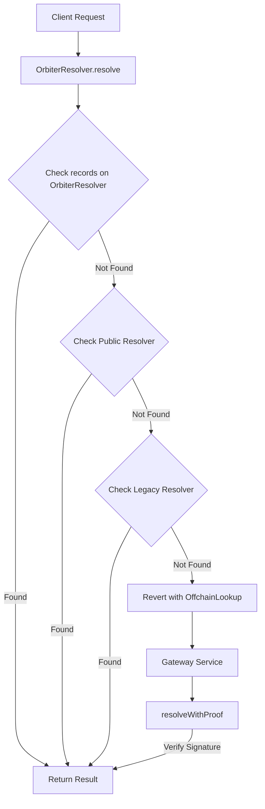

## Orbiter Resolver


A custom ENS resolver made to link Orbiter sites on Base with L1 ENS name content hashes. This contract enables Orbiter to provide a seamless experience for users to link their site with their ENS name.

## Deployments

The Orbiter Resolver is currently only deployed on Ethereum mainnet.

| Chain    | Address                                    |
|----------|--------------------------------------------|
| Ethereum | 0x4Fa456bA70dd3a36EDCFf3A077EBdC52e4DB46b2 |

## Order of Resolution

The Orbiter Resolver is unique in that it will check Public Resolvers and onchain records before falling back to the offchain gateway. This means if user's have records on the public ENS resolver they don't have to worry about re-writing them to this resolver. As long as the `contenthash` record on the public resolver is blank it will fallback to the Orbiter site that is linked to the account.



## Development

To run these contracts locally first install [Foundry](https://book.getfoundry.sh/getting-started/installation).

Clone the repo and install the dependencies

```bash
git clone https://github.com/orbiterhost/orbiter-resolver
cd orbiter-resolver
forge install
```

Compile and run tests

```bash
forge compile
forge test
```

## Deployment

Deployement includes the following arguments that must be entered

- ENS Registry Contract Address
- ENS Name Wrapper Contract Address
- URL of the offchain gateway API URL
- Address that will sign responses offchain
- Address of the owner of the contract
- ENS Public Resolver Contract Address
- ENS Legacy Public Resolver Contract Address

```bash
	forge create src/OrbiterResolver.sol:OrbiterResolver --rpc-url <RPC_URL> --account <YOUR_ACCOUNT> --broadcast --constructor-args <REGISTRY_ADDRESS> <NAME_WRAPPER_ADDRESS> https://api.example.com/lookup/{sender}/{data} <SIGNER_ADDRESS> <OWNER_ADDRESS> <PUBLIC_RESOLVER_ADDRESS> <LEGACY_RESOLVER_ADDRESS>
```

## Contact

If you have questions feel free to reach out!

[steve@orbiter.host](mailto:steve@orbiter.host)
